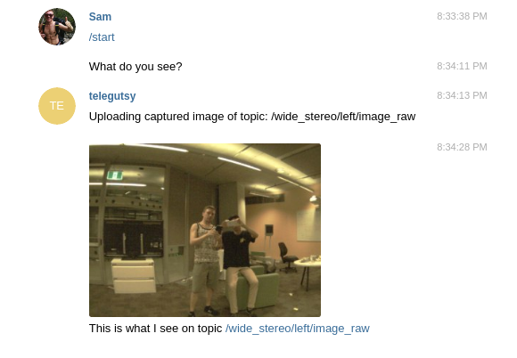
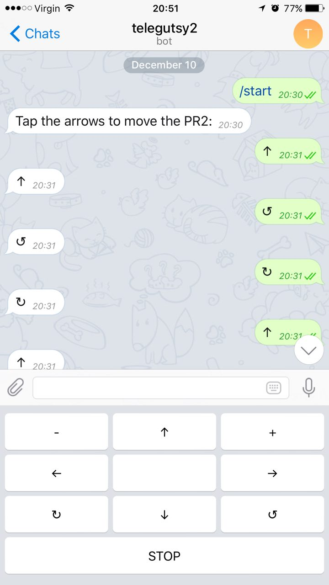

# Telegram bot for your ROS enabled robot

Given that the realtime chatting app `Telegram` [enables the use of bots](https://core.telegram.org/bots) why not connect your robot via that service?

## Requisites
You need `python-telegram-bot`.

```bash
sudo pip install python-telegram-bot --upgrade
```

You need to get a TOKEN talking to the @botfather bot as [described here](https://core.telegram.org/bots#6-botfather). Remember you can use the [Telegram web client](https://web.telegram.org/), although you still need a phone with telegram to allow connecting to it.

## Configure
Copy from [config/example_token.yaml](config/example_token.yaml) to `token.yaml` and add your token.
```bash
cp `rospack find telegram_robot`/config/example_token.yaml `rospack find telegram_robot`/config/token.yaml
```

## Launch
You can test if your token works with:
```bash
roslaunch telegram_robot echobot_example.launch
```

The bot should echo what you write to it.

## What can you do
* To publish anything the bot receives in the chat in a `std_msgs/String` topic (`/telegram_bot/telegram_chat`) use:
```
roslaunch telegram_robot chat_pub.launch
```
Then you can do whatever you want with the sentences from any other node you program.

* To make the robot answer you back an image of your choosing of any `sensor_msgs/Image` topic available:
```
roslaunch telegram_robot chat_pub.launch
```

Watch it working [in this video](https://www.youtube.com/watch?v=utGU3w-EM3g).

* To drive the robot via a `geometry_msgs/Twist` topic run:
```
roslaunch telegram_robot arrows.launch
```

Watch it working [in this video](https://www.youtube.com/watch?v=92_pIYQuYgE).

## How we got here
Telegram recommends the Python libraries:

* `Telepot`. Python framework for Telegram Bot API.
[https://github.com/nickoala/telepot](https://github.com/nickoala/telepot)

* `twx.botapi`. Library and client + documentation with Python examples.
[https://github.com/datamachine/twx.botapi](https://github.com/datamachine/twx.botapi)

And googling you also find:

* `python-telegram-bot`. Pure Python interface for the Telegram Bot API. It's compatible with Python versions 2.7, 3.3+ and PyPy. It also works with Google App Engine.
[https://github.com/python-telegram-bot/python-telegram-bot](https://github.com/python-telegram-bot/python-telegram-bot)

So we choose `python-telegram-bot` after checking which had the biggest and most active community of users and also had good documentation.